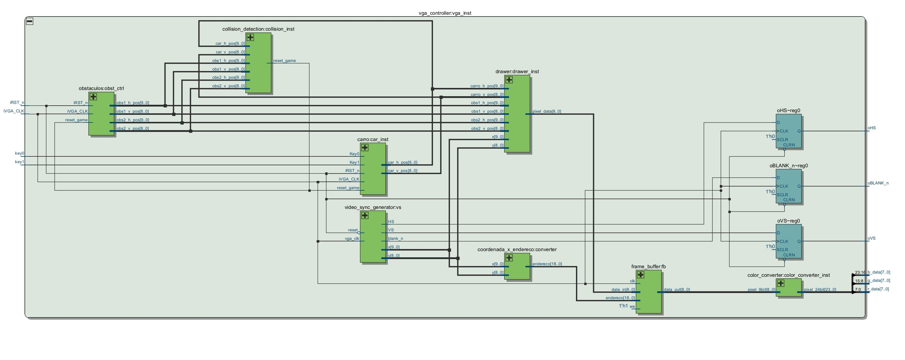

# Projeto de Jogo de Corrida com Controlador VGA

## Visão Geral do Projeto

Este projeto implementa um **jogo de corrida** utilizando FPGA, com o objetivo de simular um jogo de corrida em um display VGA. O jogo apresenta um **carro controlado pelo jogador** e **obstáculos** que aparecem na tela, enquanto o jogador precisa desviar desses obstáculos. O sistema foi projetado para ser simples, mas eficiente, utilizando os módulos básicos de controle VGA, sincronização de vídeo, controle de movimento do carro, geração de obstáculos e detecção de colisões. O fluxo de dados no projeto é cuidadosamente projetado para garantir que o jogo funcione de forma fluida.

### Objetivo do Jogo

O objetivo do jogo é controlar um carro, movendo-o para a esquerda e para a direita na tela, com o intuito de desviar dos **obstáculos** que descem pela pista. O jogo é exibido em uma tela VGA, e o jogador controla o carro usando um joystick ou outros dispositivos de entrada. Se o carro colidir com um obstáculo, o jogo termina.

## Hierarquia dos Módulos

O controlador VGA e todos os outros módulos são organizados de forma hierárquica e interconectados para criar o jogo de corrida. Abaixo estão os principais módulos do projeto e suas respectivas responsabilidades:

### 1. **Módulo `video_sync_generator` (Gerador de Sinal de Sincronização VGA)**

Este módulo é responsável por gerar os sinais necessários para controlar a sincronização da tela VGA, como **Horizontal Sync (HS)**, **Vertical Sync (VS)** e o sinal de **blanking (blank_n)**. Ele também gera as coordenadas dos pixels `x` e `y` (coordenadas cartesianas), que são usadas para determinar a posição dos objetos no display.

- **Entradas**:
  - `reset`: Sinal de reset para reiniciar o controle de sincronização.
  - `vga_clk`: Clock da VGA, geralmente de 25,175 MHz para resoluções VGA padrão.
  
- **Saídas**:
  - `HS`, `VS`: Sinais de sincronização horizontal e vertical.
  - `blank_n`: Indica se o pixel está dentro da área visível da tela.
  - `x`, `y`: Coordenadas dos pixels atuais.

Este módulo controla a criação dos sinais de sincronização necessários para o display e mantém a contagem dos pixels na horizontal e vertical para a renderização dos gráficos.

### 2. **Módulo `coordenada_x_endereco` (Conversor de Coordenadas para Endereço Linear)**

O módulo `coordenada_x_endereco` converte as coordenadas cartesianas `(x, y)` geradas pelo `video_sync_generator` para um endereço linear no **frame buffer**. Esse endereço é utilizado para acessar os dados da memória onde os gráficos do jogo são armazenados.

- **Entrada**:
  - `x`: Coordenada horizontal.
  - `y`: Coordenada vertical.

- **Saída**:
  - `endereco`: Endereço linear calculado como `endereco = y * 640 + x`, onde 640 é a largura da tela.

### 3. **Módulo `frame_buffer` (Memória de Vídeo)**

O **frame buffer** armazena os dados gráficos do jogo. Cada pixel da tela possui uma cor associada, que é armazenada no frame buffer. O módulo de **controle de cor** determina as cores dos pixels e os armazena no frame buffer. O frame buffer é acessado pelo endereço linear gerado pelo módulo `coordenada_x_endereco`.

- **Entrada**:
  - `endereco`: Endereço linear para acessar a posição do pixel no frame buffer.
  - `pixel_data`: Dados de cor do pixel (geralmente 9 bits, com 3 bits para cada cor: R, G, B).

- **Saída**:
  - Dados de cor para os pixels a serem exibidos.

### 4. **Módulo `drawer` (Desenhador de Objetos na Tela)**

O módulo `drawer` é responsável por desenhar os objetos do jogo, como o **carro** e os **obstáculos**. Ele usa as coordenadas dos pixels `(x, y)` e as compara com as posições dos objetos. Dependendo da posição e das coordenadas, o módulo desenha o carro ou os obstáculos no frame buffer.

- **Entrada**:
  - `x`, `y`: Coordenadas dos pixels.
  - `car_position`: Posição do carro na tela.
  - `obstacles`: Posições dos obstáculos.
  - `pixel_data`: Dados de cor.

- **Saída**:
  - Dados para desenhar o carro e os obstáculos no frame buffer.

### 5. **Módulo `car_controller` (Controlador do Carro)**

O **controlador do carro** é responsável por mover o carro para a esquerda ou direita com base na entrada do jogador. Ele ajusta a posição do carro de acordo com os comandos de movimento e controla a velocidade de movimento.

- **Entrada**:
  - `joystick_input`: Entrada do joystick ou controle (movimentos esquerdo/direito).
  - `clk`: Clock do jogo.

- **Saída**:
  - `car_position`: Posição atual do carro na tela.

### 6. **Módulo `obstacle_generator` (Gerador de Obstáculos)**

O módulo de **geração de obstáculos** é responsável por criar os obstáculos que descem pela tela. Os obstáculos têm posições e velocidades definidas, e o módulo garante que eles se movam de cima para baixo na tela de forma constante. Quando um obstáculo atinge a parte inferior da tela, ele é reposicionado no topo.

- **Entrada**:
  - `clk`: Clock do jogo.

- **Saída**:
  - `obstacle_position`: Posição dos obstáculos na tela.

### 7. **Módulo `collision_detection` (Detecção de Colisão)**

O **módulo de detecção de colisão** verifica se o carro colidiu com algum obstáculo. Ele faz isso comparando as posições do carro e dos obstáculos. Se eles se sobrepuserem, significa que houve uma colisão, e o jogo deve ser interrompido.

- **Entrada**:
  - `car_position`: Posição do carro.
  - `obstacle_position`: Posições dos obstáculos.

- **Saída**:
  - `collision_detected`: Indica se houve uma colisão entre o carro e um obstáculo.

## Fluxo de Dados

1. **Geração dos Sinais de Sincronização**: O módulo `video_sync_generator` gera os sinais de sincronização VGA (`HS`, `VS`) e as coordenadas cartesianas `x` e `y`, que determinam a posição dos pixels na tela.

2. **Desenhando os Objetos**: O módulo `drawer` usa as coordenadas `(x, y)` para desenhar o carro e os obstáculos no frame buffer. Ele armazena as cores correspondentes aos objetos no `pixel_data`.

3. **Controle do Carro**: O jogador controla o carro através de um joystick, que é lido pelo módulo `car_controller`. Esse módulo atualiza a posição do carro na tela.

4. **Geração e Movimento dos Obstáculos**: O módulo `obstacle_generator` gera obstáculos e os move pela tela de cima para baixo. Quando um obstáculo atinge a parte inferior da tela, ele é reposicionado no topo.

5. **Detecção de Colisão**: O módulo `collision_detection` verifica se o carro colidiu com algum obstáculo. Caso uma colisão seja detectada, o jogo termina.

## Diagrama de Blocos

